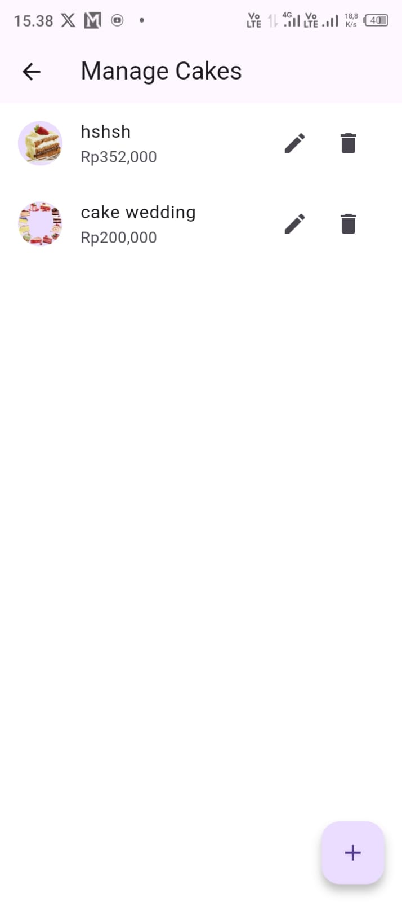

# 🍰 Flutter Bakery App

Aplikasi toko roti modern berbasis Flutter yang memungkinkan pengguna melihat daftar produk kue, mencari kue berdasarkan nama, melihat detail produk, serta menampilkan gambar-gambar menarik dari setiap kue. Terintegrasi dengan Firebase Firestore dan Firebase Storage.

---

## ✨ Fitur Utama

- 🔍 Pencarian kue secara real-time
- 🗂️ Tampilan kategori produk dalam dua mode (grid dan list)
- 🖼️ Gambar produk dari Firebase Storage
- ☁️ Integrasi Firebase Firestore (CRUD data kue)
- 📱 Desain antarmuka modern dan responsif
- 🔧 Manajemen state menggunakan Provider

---

## 🛠️ Teknologi yang Digunakan

- [Flutter](https://flutter.dev/)
- [Dart](https://dart.dev/)
- [Firebase Firestore](https://firebase.google.com/docs/firestore)
- [Firebase Storage](https://firebase.google.com/docs/storage)
- [Provider](https://pub.dev/packages/provider)
- Local SVG Assets

---

## 🚀 Cara Menjalankan Proyek

### 1. Clone Repositori

```bash
git clone https://github.com/Uyuu8/Flutter-Bakery-App.git
cd Flutter-Bakery-App
```

### 2. Install Dependency

```bash
flutter pub get
```

### 3. Tambahkan Konfigurasi Firebase

- Buat proyek baru di [Firebase Console](https://console.firebase.google.com/)
- Aktifkan **Cloud Firestore** dan **Firebase Storage**
- Unduh file konfigurasi `google-services.json`
- Letakkan file tersebut di dalam folder:
  `android/app/`

### 4. Jalankan Aplikasi

```bash
flutter run
```

> Pastikan kamu sudah menghubungkan emulator atau perangkat Android.

---

## 📁 Struktur Folder

```
lib/
├── main.dart           # Entry point aplikasi
├── page/               # Semua halaman UI (home, detail, splash, dsb.)
├── model/              # Data model (contoh: cake.dart)
├── widget/             # Widget yang dapat digunakan ulang
├── services/           # Koneksi dan fungsi Firestore
├── utils/              # Konstanta dan helper function
```

---

## 📷 Cuplikan Layar

| Loading Screen | Walkthrough 1 | Walkthrough 2 | Walkthrough 3 |
|----------------|---------------|---------------|----------------|
|  |  |  |  |

| Login Screen | Home Page | Detail Screen | Share |
|--------------|-----------|---------------|-------|
|  |  |  |  |

| Favorites | Keranjang | Manage Cake | CRUD Cake |
|-----------|-----------|-------------|------------|
|  |  |  |  |


> *Catatan: Tambahkan screenshot ke folder `assets/screenshots/` jika ingin menampilkan tangkapan layar di atas.*

---

## ✅ Rencana Pengembangan (TODO)

- [ ] Tambah autentikasi (login & register)
- [ ] Tambah fitur keranjang dan checkout
- [ ] Tambah fitur wishlist/favorit
- [ ] Panel admin untuk CRUD data kue
- [ ] Mode tema terang/gelap
- [ ] Rilis APK untuk publik

---

## 🙌 Kontribusi

Kontribusi sangat terbuka!  
Kamu bisa:

1. Fork repositori ini
2. Buat branch baru untuk fitur yang ingin ditambahkan
3. Lakukan pull request ke repositori utama

Jika menemukan bug atau ingin request fitur baru, silakan buka tab [Issues](https://github.com/Uyuu8/Flutter-Bakery-App/issues).

---

## 📄 Lisensi

Proyek ini dilisensikan di bawah **MIT License**.  
Silakan digunakan, dimodifikasi, dan dikembangkan sesuai kebutuhan, baik untuk keperluan pribadi maupun komersial.

---

## 👨‍💻 Pengembang

**Uyuu8**  
📍 [GitHub Profil](https://github.com/Uyuu8)

---

> Dibuat dengan ❤️ menggunakan Flutter & Firebase
